# fix-my-city-2.0

Fix My City is a collaborative app that is meant to implement better communication between the citizen of a city and its municipal services to fix common problems.
This is how it works:
- A user finds and issue on the street
- Opens fix my city, takes a picture of the problem and sends it
- Municipal authority see the issue and act accordingly to fix it

This version now includes the next features:
- It is now a progresive web app, PWA (it doesn't require a web browser, if you authorize it's installation)
- It pushes notifications
- Improved in performance
- Modern look
- Markers replaced by icons for each issue category
- An urgent issue is now shown as a pulsating alert

## Snapshots
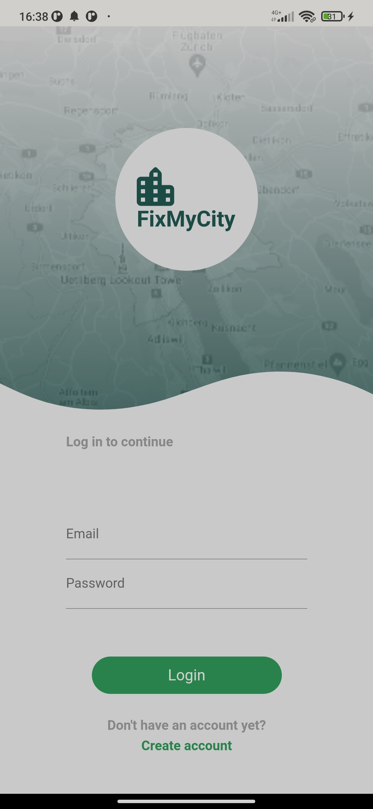
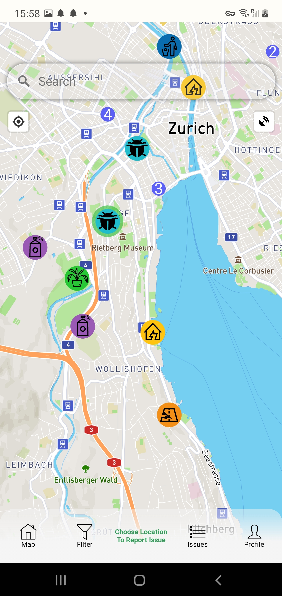
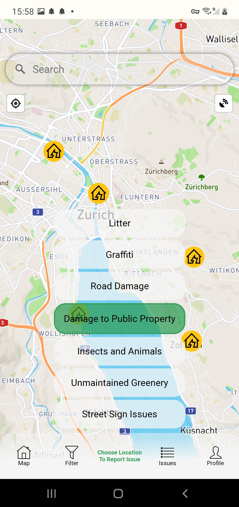
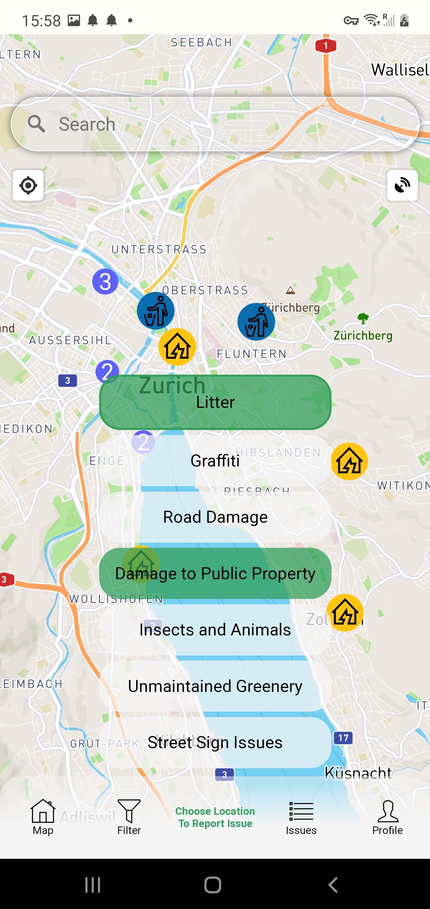
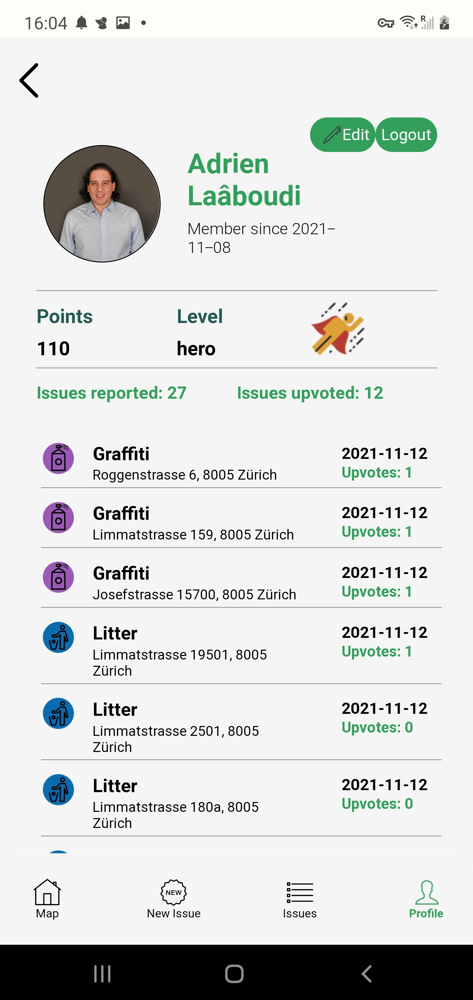
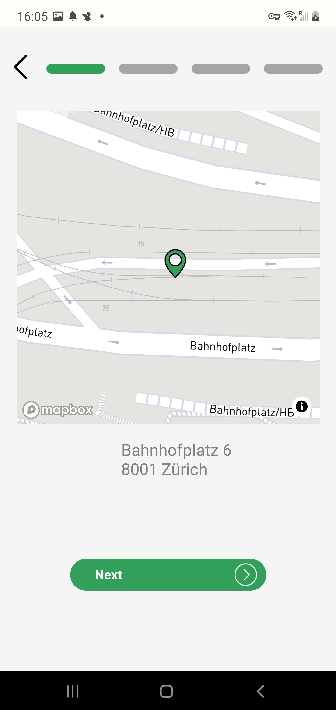
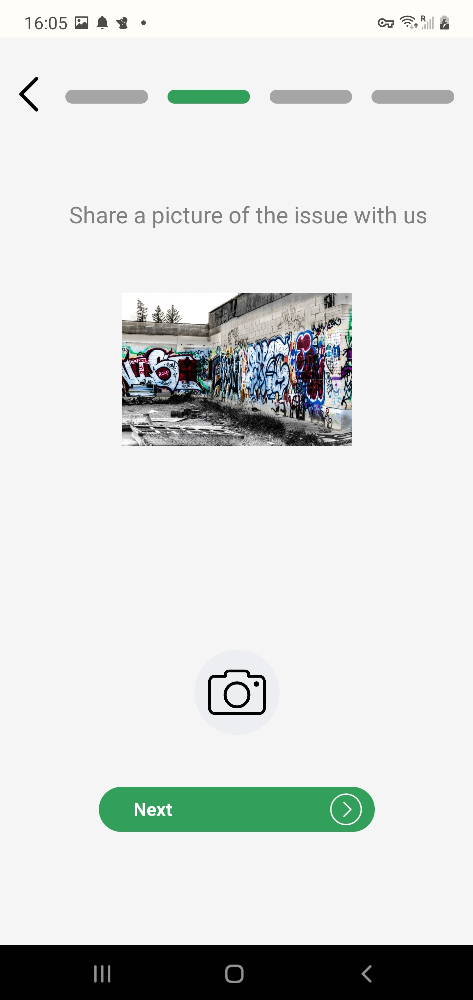
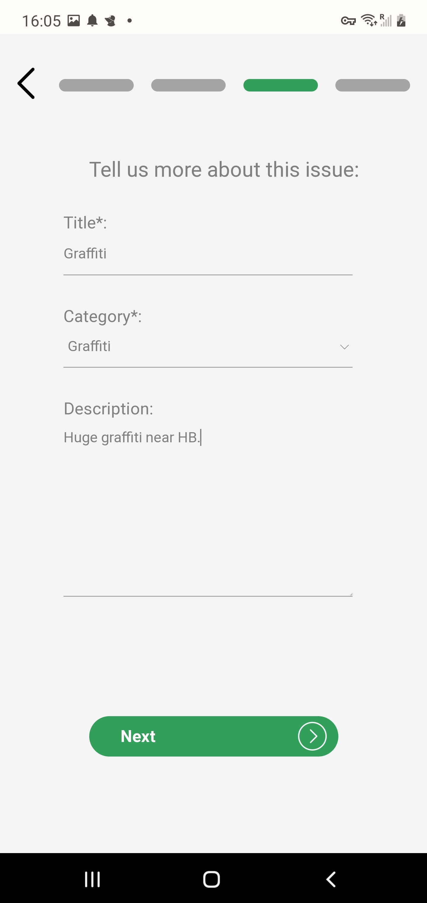
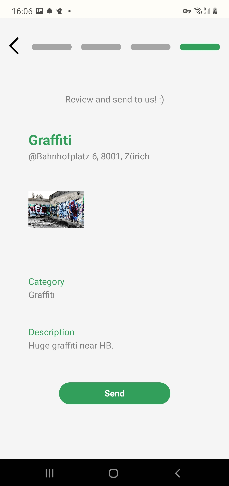
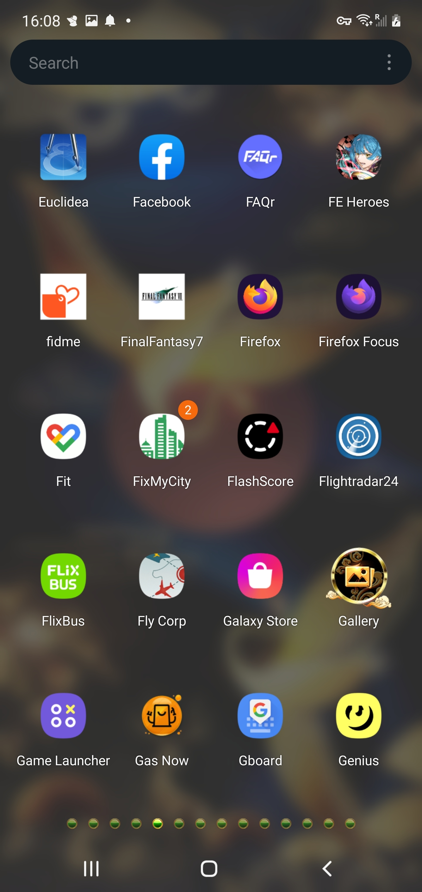
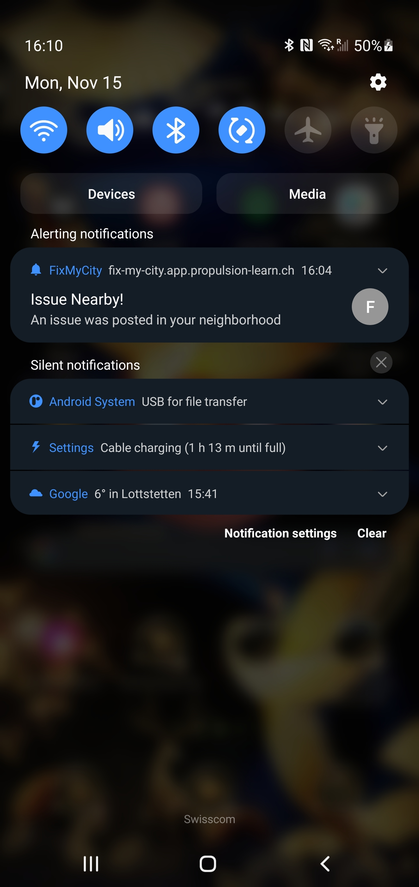
